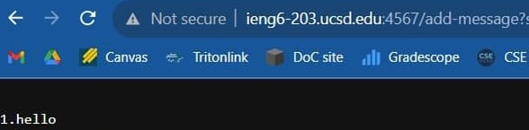
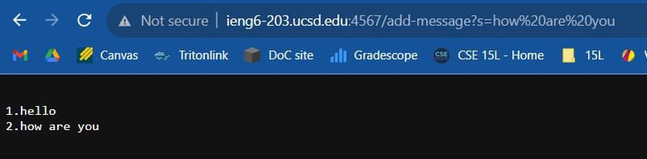

Part 1:

StringServer.java code:

import java.io.IOException;
import java.net.URI;

class StringHandler implements URLHandler {

    String message = "";
    int count = 0;
    
    public String handleRequest(URI url) {
        if (url.getPath().equals("/add-message")) {
            String[] parameters = url.getQuery().split("=");
            if (parameters[0].equals("s")) {
                count++;
                message = ( message + "\n" + count + "." + parameters[1]);
                return message;
            }
        }
        return "404 Not Found!";
    }
}

public class StringServer {
    public static void main(String[] args) throws IOException {
        if (args.length == 0) {
            System.out.println("Missing port number! Try any number between 1024 to 49151");
            return;
        }

        int port = Integer.parseInt(args[0]);

        Server.start(port, new StringHandler());
    }
}

part2:

part3:
One big thing I learned from lab from week 2 was building and running a server. I learned how to use commands such as /increment and /add within the URL to create interesting effects on the webpage.I also learned how to run the server on a remote computer using ieng6.
